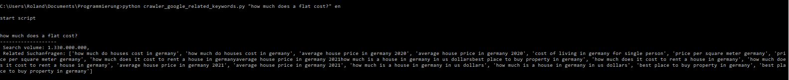

# related-keywords-search-volume
Google webscraper to get information about the number of search results and related keywords 👓

## Requirements

To install requirements.txt please run the following on the terminal.

`pip install r- requirements.txt`

## How to use it?

Use the script from your command-line

`python crawler_google_related_keywords.py "this is an example keyword" en`

The first argument must be in "" and is the keyword, the secound one is the language argument.

### Language Arguments

`en` English
`de` German
`es` Spanish

more language arguments can be found here https://developers.google.com/admin-sdk/directory/v1/languages

## Result

The result is going to look like this 

